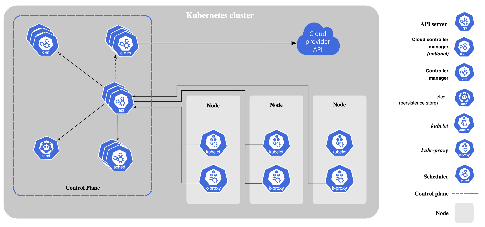
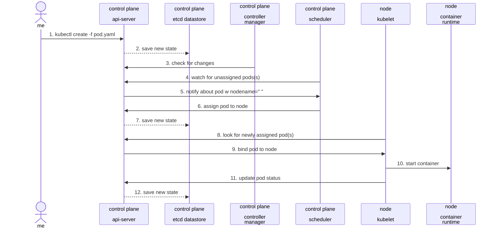

# Developing Mountpoint for Amazon S3 CSI Driver

This document and the `dev/` folder contains references, documentation, and various things for developing the CSI Driver. Note that this document is written with v2 in mind, most things should also apply to v1 but there might be slight differences.

## Background

The CSI Driver implements [Container Storage Interface (CSI)](https://github.com/container-storage-interface/spec/blob/v1.9.0/spec.md) to provide Amazon S3 Buckets as volumes for containers using [Mountpoint for Amazon S3](https://github.com/awslabs/mountpoint-s3) under the hood.
Mountpoint is based on Filesystem in Userspace (FUSE) and allows you to mount your buckets as local file systems.

Even though the CSI is a generic interface, Mountpoint for Amazon S3 CSI Driver actively only test against [Kubernetes](https://kubernetes.io/).
All end-to-end tests of the CSI Driver creates [Amazon Elastic Kubernetes Service (EKS)](https://aws.amazon.com/eks/) clusters,
installs the CSI Driver, and runs the test against the real EKS cluster.

### Kubernetes primer

Kubernetes is a container orchestration system with the following architecture:



It consist of a [control plane](https://kubernetes.io/docs/concepts/overview/components/#control-plane-components), and some amount of [nodes](https://kubernetes.io/docs/concepts/overview/components/#node-components).

The control plane contains components:
  - [kube-apiserver](https://kubernetes.io/docs/concepts/architecture/#kube-apiserver) – the front end for the Kubernetes control plane
  - [etcd](https://kubernetes.io/docs/concepts/architecture/#etcd) – the key value store used as Kubernetes' backing store for all cluster data
  - [kube-scheduler](https://kubernetes.io/docs/concepts/architecture/#kube-scheduler) – the default scheduler that assigns pending pods to suitable nodes
  - [kube-controller-manager](https://kubernetes.io/docs/concepts/architecture/#kube-controller-manager) – the component that runs controllers

The nodes contains components:
  - [kubelet](https://kubernetes.io/docs/concepts/architecture/#kubelet) – the component that runs on each node that is responsible for running pods/containers and communicating with the control plane
  - [Container runtime](https://kubernetes.io/docs/concepts/architecture/#container-runtime) – the runtime responsible for running the containers

Cluster admins would usually interact with the cluster using tools like [kubectl](https://kubernetes.io/docs/reference/kubectl/). kubectl allows you to define your [Kubernetes objects](https://kubernetes.io/docs/concepts/overview/working-with-objects/#kubernetes-objects) as YAML files, and submit these manifests to the control plane.

These Kubernetes objects defines the desired state, and once submitted to the control plane, multiple [Kubernetes controllers](https://kubernetes.io/docs/concepts/architecture/controller/) would try to make the current state match to the desired state.

[Pods](https://kubernetes.io/docs/concepts/workloads/pods/) are Kubernetes objects for defining one or more containers to run in your clusters with shared storage and network resources. Pods are the smallest deployable compute units you can run in Kubernetes.

For example, you can define a Pod to run an nginx container with the following YAML file `pod.yaml`:

```yaml
apiVersion: v1
kind: Pod
metadata:
  name: nginx
spec:
  containers:
  - name: nginx
    image: nginx:1.14.2
    ports:
    - containerPort: 80
```

You can apply this manifest to your cluster using kubectl (assuming you have a cluster configured):
```bash
$ kubectl create -f pod.yaml
```

This is what happens at high level when you run `kubectl create -f pod.yaml`:



#### Kubernetes Storage

Kubernetes provide both persistent and temporary storage to the Pods via [volumes](https://kubernetes.io/docs/concepts/storage/volumes/). Pods can use any number of persistent or temporary volumes simultaneously. Temporary or [ephemeral volumes](https://kubernetes.io/docs/concepts/storage/ephemeral-volumes/) usually have a lifecycle tied to the Pods, and gets deleted alongise the Pod. [Persistent volumes](https://kubernetes.io/docs/concepts/storage/persistent-volumes/) on the other hand can outlive Pods, and can be shared among multiple Pods if the [access mode](https://kubernetes.io/docs/concepts/storage/persistent-volumes/#access-modes) of the volume allows. Kubernetes won't destroy persistent volumes at Pod termination, it is up to cluster admins to manually delete them or use external tools to manage their lifecycles.

The volumes basically represented as directories within Pods, you specify volumes to use in the Pod definition, and then you can mount these volumes within containers at the desired path. As a result, the containers would have a filesystem with the desired volumes mounted.

For example, this is how you'd use a [emptyDir](https://kubernetes.io/docs/concepts/storage/volumes/#emptydir) – an ephemeral volume created from the kubelet's backing storage medium:

```yaml
apiVersion: v1
kind: Pod
metadata:
  name: test-pd
spec:
  volumes:
  # List of available volumes for the containers to use
  - name: cache-volume
    emptyDir:
      sizeLimit: 500Mi
  containers:
  - image: busybox
    name: busybox
    # Mounting the volume `cache-volume` in the container at `/cache`
    volumeMounts:
    - mountPath: /cache
      name: cache-volume
```

Kubernetes would automatically create the volume with 500MiB limit, and would also automatically terminate alongside the Pod.

Kubernetes provides many kind of volume types out of the box, but it also provides support for [out-of-tree volume plugins](https://kubernetes.io/docs/concepts/storage/volumes/#out-of-tree-volume-plugins) – which most importantly allows CSI Drivers to provide new volume types without needing to change Kubernetes source. A CSI Driver volume can be used through three different way:
  - Through a [PersistentVolume](https://kubernetes.io/docs/concepts/storage/persistent-volumes/#persistent-volumes) referenced by a [`persistentVolumeClaim`](https://kubernetes.io/docs/concepts/storage/volumes/#persistentvolumeclaim)
  - Through a [generic ephemeral volumes](https://kubernetes.io/docs/concepts/storage/ephemeral-volumes/#generic-ephemeral-volumes)
  - Through a [CSI ephemeral volume](https://kubernetes.io/docs/concepts/storage/ephemeral-volumes/#csi-ephemeral-volumes)

Last two as you can guess from their names aims to provide ephemeral volumes where the lifecycle of the volume would be tied to a Pod. The first one aims to provide persistent volumes which is more suitable for Amazon S3 and it is the only volume type the CSI Driver supports as of `v2.0.0`.

The way to use PersistentVolumes (PVs) in a Pod is through [PersistentVolumeClaims (PVCs)](https://kubernetes.io/docs/concepts/storage/persistent-volumes/#persistentvolumeclaims). The PVCs are basically ways to consumers to request or claim persistent storages with desired properties like capacities and access modes. There is a one-to-one mapping between PVCs and PVs, and a Pod using a PVC won't be ready to run until the PVC is bound to a PV.

The [binding process](https://kubernetes.io/docs/concepts/storage/persistent-volumes/#binding) of a PVC to a PV depends on the [provisioning mode](https://kubernetes.io/docs/concepts/storage/persistent-volumes/#provisioning), which can be static or dynamic. With static provisoninig, the cluster admins would create PVs representing available storage to the cluster, and PVCs would only be able to claim existing PVs. With dynamic provisioning, the cluster admins would instead create [StorageClasses](https://kubernetes.io/docs/concepts/storage/storage-classes/) which basically act as templates for PVs, and the cluster would automatically provision PVs based on StorageClass definition and PVC requests. The CSI Driver only supports [static provisinonig](https://github.com/awslabs/mountpoint-s3-csi-driver/blob/main/docs/CONFIGURATION.md#static-provisioning) as of `v2.0.0`.

For example, this is how you'd use the CSI Driver to mount `amzn-s3-demo-bucket` bucket at `/data`:

```yaml
apiVersion: v1
kind: PersistentVolume
metadata:
  name: s3-pv
spec:
  # ...
  storageClassName: "" # Required for static provisioning
  claimRef: # To ensure no other PVCs can claim this PV
    namespace: default
    name: s3-pvc # Name of your PVC
  csi:
    driver: s3.csi.aws.com
    volumeHandle: s3-pv
    volumeAttributes:
      bucketName: amzn-s3-demo-bucket

---
apiVersion: v1
kind: PersistentVolumeClaim
metadata:
  name: s3-pvc
spec:
  # ...
  storageClassName: "" # Required for static provisioning
  volumeName: s3-pv # Name of your PV

---
apiVersion: v1
kind: Pod
metadata:
  name: test-pd
spec:
  volumes:
  - name: s3-volume
    persistentVolumeClaim:
      claimName: s3-pvc
  containers:
  - image: busybox
    name: busybox
    volumeMounts:
    - mountPath: /cache
      name: s3-volume
```

### CSI

The CSI defines three main services:
  - [Identity Service](https://github.com/container-storage-interface/spec/blob/v1.9.0/spec.md#identity-service-rpc) – For providing healthcheck, plugin version and set of features provided by the CSI Driver
  - [Node Service](https://github.com/container-storage-interface/spec/blob/v1.9.0/spec.md#node-service-rpc) – For doing mounting in the node by communicating with kubelet
  - [Controller Service](https://github.com/container-storage-interface/spec/blob/v1.9.0/spec.md#controller-service-rpc) – For doing dynamic provisioning, volume publishing etc. by communicating with the control plane

As of `v2.0.0`, the CSI Driver only implements [node](https://github.com/awslabs/mountpoint-s3-csi-driver/blob/v2.0.0/pkg/driver/node/node.go) and [identity](https://github.com/awslabs/mountpoint-s3-csi-driver/blob/v2.0.0/pkg/driver/identity.go) services.

For node service, the most important RPC calls the CSI Driver implement are `NodePublishVolume` and `NodeUnpublishVolume`. They are called by kubelet whenever a Pod uses a volume provided by the CSI Driver, and the calls are basically performs mounting and unmounting an S3 volume to a pod respectively.

#### `NodePublishVolume`

In this RPC call, the CSI Driver receives details of the volume and a target path to mount the filesystem.

Most importantly, the CSI Driver receives `mountOptions` and `volumeAttributes` of the PV. These are free-form fields that the CSI Driver free to interpret or design. The CSI Driver passes `mountOptions` to Mountpoint process as-is mostly, and uses information from `volumeAttributes` to decide on credentials, cache configuration etc., and at the ends converts them to more Mountpoint options. See [`volumecontext` Go package](https://github.com/awslabs/mountpoint-s3-csi-driver/blob/v2.0.0/pkg/driver/node/volumecontext/volume_context.go) for set of configuration the CSI Driver accepts in `volumeAttributes`.

```yaml
apiVersion: v1
kind: PersistentVolume
metadata:
  name: s3-pv
spec:
  # ...
  mountOptions:
    # These are mostly corresponds to Mountpoint's options
    - allow-delete
    - region us-west-2
    - prefix some-s3-prefix/
  csi:
    driver: s3.csi.aws.com
    # These are specific to the CSI Driver, but sometimes they also change the arguments the CSI Driver passes to Mountpoint
    volumeAttributes:
      bucketName: amzn-s3-demo-bucket
      authenticationSource: pod
      cache: emptyDir
      cacheEmptyDirSizeLimit: 2Gi
```

The CSI Driver also does mounting in this method if the filesystem is not mounted yet, and also updates credentials on each call to ensure Mountpoint always has up-to-date credentials.

#### `NodeUnpublishVolume`

In this RPC call, the CSI Driver basically reverts the operations performed in the `NodePublishVolume` call. Namely, the CSI Driver unmounts the filesystem provided for the Pod, and then cleans up any written credentials.

### Architecture of Mountpoint for Amazon S3 CSI Driver

See [the architecture document](/docs/ARCHITECTURE.md) of Mountpoint for Amazon S3 CSI Driver for more details on the design of the CSI Driver.

## Development

First step would be creating a real Kubernetes cluster, we recommend using an Amazon EKS cluster to test any changes to the CSI Driver. [eksctl](https://eksctl.io/) is the recommended tool to manage EKS clusters.

### Create a cluster

You can create a dev cluster with recommended options by running:

```bash
$ pwd
~/mountpoint-s3-csi-driver

$ eksctl create cluster -f dev/mp-dev-cluster.yaml --timeout 1h
2025-08-20 16:40:21 [ℹ]  eksctl version 0.208.0
2025-08-20 16:40:21 [ℹ]  using region eu-north-1
2025-08-20 16:40:22 [ℹ]  setting availability zones to [eu-north-1b eu-north-1c eu-north-1a]
...
2025-08-20 16:57:04 [ℹ]  kubectl command should work with "/Users/burakvar/.kube/config", try 'kubectl get nodes'
2025-08-20 16:57:04 [✔]  EKS cluster "mp-dev-cluster" in "eu-north-1" region is ready
```

It might take around 15-20 minutes to create the cluster, at the end it should configure your kubectl to access to your cluster.
You can verify this by running:
```bash
$ kubectl get no
NAME                                           STATUS   ROLES    AGE   VERSION
ip-192-168-26-202.eu-north-1.compute.internal   Ready    <none>   13m   v1.33.3-eks-3abbec1
```

Now you should also get [Container Insights](https://docs.aws.amazon.com/AmazonCloudWatch/latest/monitoring/ContainerInsights.html) enabled for your cluster for metrics and logs.

### Install the CSI Driver Helm chart from source

[Helm](https://helm.sh/) is a package manager for Kubernetes and the CSI Driver provides a Helm chart for customers to consume.

The Helm chart for the CSI Driver lives in `/charts/aws-mountpoint-s3-csi-driver` folder. You'd need to re-install the Helm chart if you make any changes in that folder.
A Helm chart is basically collection of Kubernetes objects to be installed on the target Kubernetes cluster.

The CSI Driver's Helm chart basically contains Kubernetes objects for deploying the CSI Driver's Pods, namespace, permissions etc.

You can follow [Helm's installation guidance](https://helm.sh/docs/intro/install/) to install it.

Once you have Helm installed, you can install the CSI Driver's Helm chart from source into your Kubernetes cluster:
```bash
$ pwd
~/mountpoint-s3-csi-driver

$ helm upgrade --install aws-mountpoint-s3-csi-driver \
    --namespace kube-system \
   ./charts/aws-mountpoint-s3-csi-driver
```

This would install the Helm chart with the default values. You can customise [default values](/charts/aws-mountpoint-s3-csi-driver/values.yaml) by using `--set`:
```bash
$ helm upgrade --install aws-mountpoint-s3-csi-driver \
    --namespace kube-system \
    --set controller.nodeSelector."kubernetes\.io/role"="control-plane" \
   ./charts/aws-mountpoint-s3-csi-driver
```

You can verify that the CSI Driver is installed by listing all Pods owned by the CSI Driver:
```bash
$ kubectl get pods -lapp.kubernetes.io/name=aws-mountpoint-s3-csi-driver -A
NAMESPACE     NAME                                 READY   STATUS    RESTARTS   AGE
kube-system   s3-csi-controller-6b4cbf9ddf-nm74l   1/1     Running   0          54s
kube-system   s3-csi-node-dfmhd                    3/3     Running   0          54s
```

You can uninstall the Helm chart by running:
```bash
$ helm uninstall -n kube-system aws-mountpoint-s3-csi-driver
```

### Building the CSI Driver's container image from source

The Helm chart by default uses latest released container image of the CSI Driver,
that could be fine if you only need to make changes on the Helm chart,
but most of the time you'd also want to change the containers.

For that, you'd need to build a container image from source, push it to a registry, and configure the Helm chart to use that image instead.

We can use [Amazon Elastic Container Registry (ECR)](https://aws.amazon.com/ecr/) to host our container image. We can use [AWS CLI](https://aws.amazon.com/cli/) to create a private ECR repository:

```bash
# Same region as the cluster, see "./mp-dev-cluster.yaml"
$ aws ecr create-repository \
    --region eu-north-1 \
    --repository-name mp-dev
{
    "repository": {
        "repositoryArn": "arn:aws:ecr:eu-north-1:111122223333:repository/mp-dev",
        "registryId": "111122223333",
        "repositoryName": "mp-dev",
        "repositoryUri": "111122223333.dkr.ecr.eu-north-1.amazonaws.com/mp-dev",
        "createdAt": "2025-08-21T11:21:54.653000+01:00",
        "imageTagMutability": "MUTABLE",
        "imageScanningConfiguration": {
            "scanOnPush": false
        },
        "encryptionConfiguration": {
            "encryptionType": "AES256"
        }
    }
}
```

Now that we have a registry, we can now build our container image and push there.

We're using [Docker CLI](https://docs.docker.com/reference/cli/docker/) and [Docker Buildx](https://github.com/docker/buildx) to build and push the container image.
You can install [Docker Desktop](https://docs.docker.com/desktop/), [Colima](Colima) or anything to get Docker CLU up and running.

We do have a [Dockerfile](/Dockerfile) for our container image and a [Makefile](/Makefile) for building images, you can read the sources for more details.

You can use the following command to build and push the container image from source:

```bash
$ pwd
~/mountpoint-s3-csi-driver

# Note this example only builds for a single-platform, 'ALL_ARCH_linux="amd64"'.
# In production, we build a multi-platform image by setting 'ALL_ARCH_linux="amd64 arm64"',
# you'd need a Docker installation capable of doing multi-platform builds if you want to achieve the same outcome,
# see https://docs.docker.com/build/building/multi-platform/#strategies.
# Building for single-platform should be okay for day-to-day development unless you have a specific case where it requires building a multi-platform image.

# Our Makefile would skip building again if this file is present, make sure it is not
$ rm -f .image-latest-linux-amd64-amazon

# "REGISTRY", "IMAGE_NAME", and "REGION" are from the previous step.
$ REGISTRY="111122223333.dkr.ecr.eu-north-1.amazonaws.com" \
  REGION="eu-north-1" \
  IMAGE_NAME="mp-dev" \
  ALL_ARCH_linux="amd64" \
  TAG="latest" \
  make login_registry all-push
...
=> [internal] pushing 111122223333.dkr.ecr.eu-north-1.amazonaws.com/mp-dev:latest
```

You can verify that the image is pushed to your ECR repository by running:
```bash
$ aws ecr list-images \
   --region eu-north-1 \
   --repository-name mp-dev
{
   "imageIds": [
       {
           "imageDigest": "sha256:109a65e8778f24eaefa416b9d1df68521b959f59e55a39cc74d6cd8a076f0aeb",
           "imageTag": "latest-linux-amd64-amazon"
       },
       {
           "imageDigest": "sha256:358796b58c8a3439a0ff60c76d6e535c4cb23e1f0d460af13a90ca053d6af065",
           "imageTag": "latest"
       }
   ]
}
```

Now you have source-build container image in your ECR repository, the final step is configuring the Helm chart to use that image instead of a latest release version.

The CSI Driver's Helm chart already allows you to specify container image:

```bash
$ pwd
~/mountpoint-s3-csi-driver

# "image.pullPolicy=Always" is important because Kubernetes by default would cache the image,
# and since we're using fixed "latest" tag, our changes won't be reflected if Kubernetes would still use the old cached image.
# "image.pullPolicy=Always" disables this caching behaviour and ensures Kubernetes would always pull the latest image each time it starts the CSI Driver's containers.
$ helm upgrade --install aws-mountpoint-s3-csi-driver \
    --namespace kube-system \
    --set image.repository="111122223333.dkr.ecr.eu-north-1.amazonaws.com/mp-dev" \
    --set image.pullPolicy=Always \
    --set image.tag=latest \
   ./charts/aws-mountpoint-s3-csi-driver
```

Each time after you push a new version of the container image, you'd need to restart the Pods for changes to take effect. You can verify your Pods has the up-to-date container image by checking the hash:

```bash
# Node
$ kubectl -n kube-system get po -lapp=s3-csi-node -o=jsonpath='{.items[*].status.containerStatuses[?(@.name=="s3-plugin")].imageID}'
111122223333.dkr.ecr.eu-north-1.amazonaws.com/mp-dev@sha256:358796b58c8a3439a0ff60c76d6e535c4cb23e1f0d460af13a90ca053d6af065

# Controller
$ kubectl -n kube-system get po -lapp=s3-csi-controller -o=jsonpath='{.items[*].status.containerStatuses[?(@.name=="s3-csi-controller")].imageID}'
111122223333.dkr.ecr.eu-north-1.amazonaws.com/mp-dev@sha256:358796b58c8a3439a0ff60c76d6e535c4cb23e1f0d460af13a90ca053d6af065
```

When you run `helm upgrade` it would automatically restart the Pods, but after initial `helm upgrade` you can just use the following commands to restart the CSI Driver pods:

```bash
$ kubectl -n kube-system delete po -lapp=s3-csi-controller
$ kubectl -n kube-system delete po -lapp=s3-csi-node
```

Not that this only restarts the node and the controller, but it wouldn't restart the Mountpoint Pods. You'd need to re-create your workload to restart Mountpoint Pods.

### Building Mountpoint from source alongside the CSI Driver

> [!NOTE]
> Building Mountpoint from source on macOS with a VM might take longer.
> If you see warnings like
>   ```
>   #15 742.0 <jemalloc>: MADV_DONTNEED does not work (memset will be used instead)
>   #15 742.0 <jemalloc>: (This is the expected behaviour if you are running under QEMU)
>   ```
> you might consider setting up a native Linux host and use that as your Docker host by setting `export DOCKER_HOST=ssh://my@linux-host` for a better building speed.

By default, the CSI Driver bundles a released version of Mountpoint, you can see the version as `MOUNTPOINT_VERSION` in the [Dockerfile](/Dockerfile).
If you're working on something that also requires a change on Mountpoint itself, it might be useful to build Mountpoint from source as well instead of using a released version.

To help with that, the CSI Driver comes with a second Dockerfile called [Dockerfile.local](/Dockerfile.local) - where it also builds Mountpoint from source and bundles that Mountpoint binary instead.

You can customize the following arguments to specify the repository, the branch, and the build arguments:
```Dockerfile
ARG MOUNTPOINT_REPOSITORY="https://github.com/awslabs/mountpoint-s3"
ARG MOUNTPOINT_BRANCH="experimental/metrics"
ARG MOUNTPOINT_VERSION="experimental-metrics"
ARG MOUNTPOINT_BUILD_ARGS="" # e.g., --features express_cache
```

All `make` command uses default Dockerfile by default, you can specify to use `Dockerfile.local` instead by providing `DOCKERFILE="Dockerfile.local"` to make commands:

```bash
$ pwd
~/mountpoint-s3-csi-driver

# Our Makefile would skip building again if this file is present, make sure it is not
$ rm -f .image-latest-linux-amd64-amazon

$ REGISTRY="111122223333.dkr.ecr.eu-north-1.amazonaws.com" \
  REGION="eu-north-1" \
  IMAGE_NAME="mp-dev" \
  ALL_ARCH_linux="amd64" \
  TAG="latest" \
  DOCKERFILE="Dockerfile.local" \
  make login_registry all-push
...
#16 [mp_builder 5/5] RUN cd mountpoint-s3 &&     cargo build  --release
#16 71.32    Compiling git2 v0.20.2
#16 74.20    Compiling built v0.8.0
#16 74.76    Compiling mountpoint-s3-client v0.18.0 (/mountpoint-s3/mountpoint-s3-client)
#16 74.76    Compiling mountpoint-s3 v1.19.1 (/mountpoint-s3/mountpoint-s3)
...
=> [internal] pushing 111122223333.dkr.ecr.eu-north-1.amazonaws.com/mp-dev:latest
```

Now you can check the CSI Driver's logs to see Mountpoint version. First, restart the CSI Driver Pods so they can pick up the new image:

```bash
$ kubectl -n kube-system delete po -lapp=s3-csi-controller
$ kubectl -n kube-system delete po -lapp=s3-csi-node
```

Now you can check the first log line of one of the node Pods:
```bash
$ kubectl -n kube-system logs -lapp=s3-csi-node -c=s3-plugin --tail=-1 | head -n1
I0822 10:03:01.606349       1 driver.go:101] Driver version: 2.0.0, Git commit: f3811ade4e1e821381a2758feaad32fe0704144f, build date: 2025-08-14T16:51:35Z, nodeID: ip-192-168-26-202.eu-north-1.compute.internal, mount-s3 version: unreleased-memory-pool, kubernetes version: v1.33.3-eks-ace6451
```

You can see the Mountpoint version: `mount-s3 version: unreleased-memory-pool`.

> [!TIP]
> You can use tools like [stern](https://github.com/stern/stern) to tail logs from multiple Kubernetes containers.
> For example, `stern -n kube-system s3-csi` would tail all logs for the CSI Driver's node and controller containers.
> It would also automatically pickup and show restarted containers.


### Helper script

It's good to do everything manually to understand what's going on, but it's also cumbersome to memorize all commands in a day-to-day development.
To help with day-to-day tasks, the CSI Driver also has a helper script.

The helper script has the following defaults and you can customize any of them:
```bash
$ export MOUNTPOINT_CSI_DEV_REGION=eu-north-1
$ export MOUNTPOINT_CSI_DEV_ECR_REPO_NAME=mp-dev
$ export MOUNTPOINT_CSI_DEV_CLUSTER_NAME=mp-dev-cluster
```

If you want to customize, you would probably persist these environment variables in your shell config by putting it into `~/.zshrc`, `~/.bashrc` or somewhere.

You can use the following commands to create ECR repository & EKS cluster and deploy Helm chart & the containers!

```bash
$ pwd
~/mountpoint-s3-csi-driver

$ ./dev/mp-dev.sh setup
running full setup...
checking if ECR repository 'mp-dev' exists in region 'eu-north-1'...
creating ECR repository 'mp-dev'...
...
checking if EKS cluster 'mp-dev-cluster' exists in region 'eu-north-1'...
creating EKS cluster 'mp-dev-cluster' using eksctl, this might take 15-20 minutes...
...

$ ./dev/mp-dev.sh deploy-helm-chart
deploying Helm chart...
Release "aws-mountpoint-s3-csi-driver" has been upgraded. Happy Helming!
NAME: aws-mountpoint-s3-csi-driver
LAST DEPLOYED: Thu Aug 21 13:55:36 2025
NAMESPACE: kube-system
STATUS: deployed
REVISION: 5
TEST SUITE: None

$ ./dev/mp-dev.sh deploy-containers
deploying containers...
...
=> [internal] pushing 111122223333.dkr.ecr.eu-north-1.amazonaws.com/mp-dev:latest
pod "s3-csi-controller-844bbc987c-nhmgm" deleted
pod "s3-csi-node-mw8gr" deleted

$ ./dev/mp-dev.sh help
usage: ./dev/mp-dev.sh <command>

available commands:
  deploy-helm-chart        deploy the Helm chart from source
  deploy-containers        build the containers from source, push to ECR, and restart the Csi Driver pods
                              --build-mountpoint: use Dockerfile.local instead of Dockerfile to build Mountpoint from source
  deploy                   deploy both Helm chart and containers from source
  help                     show this help message

required environment variables:
  MOUNTPOINT_CSI_DEV_ECR_REPOSITORY  ECR repository URL (e.g., 111122223333.dkr.ecr.eu-north-1.amazonaws.com/mp-dev)
  MOUNTPOINT_CSI_DEV_REGION          AWS region for the dev stack (e.g., eu-north-1)
```

### Running tests

Ideally you would want to run tests before or after making any change. The CSI Driver has three different test suites:

#### Unit tests
The unit tests are mostly written with in-memory implementations of various external resources,
most notable one is the Kubernetes client where we use [k8s.io/client-go/kubernetes/fake](https://pkg.go.dev/k8s.io/client-go/kubernetes/fake) to create an in-memory Kubernetes client and add objects to it for testing.

The unit tests are scattered in `/cmd` and `/pkg` folders in `*_test.go` files.

Running unit tests requires you to have Go installed, you can follow [Go's installation guidance](https://go.dev/doc/install) to install it.

These tests runs usually pretty fast, and you can run all test suites using:
```bash
$ pwd
~/mountpoint-s3-csi-driver

$ make test
...
ok      github.com/awslabs/mountpoint-s3-csi-driver/tests/sanity        0.657s
```

This command runs both unit tests and also [sanity test of Kubernetes CSI](https://kubernetes-csi.github.io/docs/unit-testing.html).

You can also use Go directly run specific tests if you're working on a specific feature, for example:
```bash
# Only run credential provider tests
$ go test ./pkg/driver/node/credentialprovider/...
ok      github.com/awslabs/mountpoint-s3-csi-driver/pkg/driver/node/credentialprovider  1.004s
ok      github.com/awslabs/mountpoint-s3-csi-driver/pkg/driver/node/credentialprovider/awsprofile       0.283s
?       github.com/awslabs/mountpoint-s3-csi-driver/pkg/driver/node/credentialprovider/awsprofile/awsprofiletest        [no test files]
?       github.com/awslabs/mountpoint-s3-csi-driver/pkg/driver/node/credentialprovider/mocks    [no test files]

# Only run Mountpoint Pod Watcher tests
$ go test -v ./pkg/podmounter/mppod/watcher/watcher_test.go
=== RUN   TestGettingAlreadyScheduledAndReadyPod
--- PASS: TestGettingAlreadyScheduledAndReadyPod (0.15s)
=== RUN   TestGettingScheduledButNotYetReadyPod
--- PASS: TestGettingScheduledButNotYetReadyPod (0.11s)
=== RUN   TestGettingNotYetScheduledPod
--- PASS: TestGettingNotYetScheduledPod (0.13s)
=== RUN   TestGettingUnschedulablePod
--- PASS: TestGettingUnschedulablePod (0.12s)
=== RUN   TestGettingPodsConcurrently
--- PASS: TestGettingPodsConcurrently (0.11s)
PASS
ok      command-line-arguments  1.159s
```

#### Controller tests

The [controller component](/docs/ARCHITECTURE.md#the-controller-component-aws-s3-csi-controller) of the CSI Driver
is mainly responsible for managing Mountpoint Pods by communicating with the Kubernetes control plane.

The CSI Driver uses [envtest](https://pkg.go.dev/sigs.k8s.io/controller-runtime/pkg/envtest) to setup a local Kubernetes control plane and run test against it.

These controller tests can be found in `/tests/controller` folder, and can be run by:

```bash
$ pwd
~/mountpoint-s3-csi-driver

$ make test
...
Ran 55 of 55 Specs in 159.773 seconds
SUCCESS! -- 55 Passed | 0 Failed | 0 Pending | 0 Skipped
--- PASS: TestControllers (159.77s)
PASS
ok      github.com/awslabs/mountpoint-s3-csi-driver/tests/controller    160.335s
```

These tests by default downloads and runs against 1.33 version of Kubernetes control plane, and in [the CI they run against our whole version matrix](/.github/workflows/controller-tests.yaml).

See [Writing controller tests](https://book.kubebuilder.io/cronjob-tutorial/writing-tests) and
[Configuring envtest for integration tests](https://book.kubebuilder.io/reference/envtest) for more details on controller tests.

#### End-to-end tests

The CSI Driver has a end-to-end test suite as well. These tests run against real Kubernetes clusters with [a various Kubernetes version and host matrix in the CI](/.github/matrix.yaml) for each PR.

These end-to-end tests can be found in `/tests/e2e-kubernetes` folder.
These tests simulate workloads by creating PVs, PVCs, and Pods to use S3 volumes provided by the CSI Driver using [Ginkgo](https://github.com/onsi/ginkgo) testing framework.

You can also run them locally against your development Kubernetes cluster.
Your cluster needs to have a node instance profile with S3 and S3 Express full access for tests to run properly, `mp-dev-cluster.yaml` configures necessary instance profile by default.
See [the CI setup](https://github.com/awslabs/mountpoint-s3-csi-driver/blob/v2.0.0/tests/e2e-kubernetes/scripts/eksctl-patch.json) for more details.

You need to have a working kubectl configuration for your cluster. After that, you can run them by:

```bash
$ pwd
~/mountpoint-s3-csi-driver

$ cd tests/e2e-kubernetes
$ KUBECONFIG=~/.kube/config \
    go test -ginkgo.vv -timeout 60m \
    --bucket-region=eu-north-1 --cluster-name=mp-dev-cluster
```

The end-to-end tests sometimes depends on external tools to be configured, otherwise some tests would be skipped:

  - [IAM OIDC](https://docs.aws.amazon.com/eks/latest/userguide/enable-iam-roles-for-service-accounts.html) – All [IRSA tests](https://github.com/awslabs/mountpoint-s3-csi-driver/blob/v2.0.0/tests/e2e-kubernetes/testsuites/credentials.go#L421-L450) would be skipped if its not configured. `mp-dev-cluster.yaml` configures OIDC provider by default.
  - [Amazon EKS Pod Identity Agent](https://docs.aws.amazon.com/eks/latest/userguide/pod-id-agent-setup.html) – All [EKS Pod Identity tests](https://github.com/awslabs/mountpoint-s3-csi-driver/blob/v2.0.0/tests/e2e-kubernetes/testsuites/credentials.go#L452-L481) would be skipped if its not installed. `mp-dev-cluster.yaml` installs EKS Pod Identity agent by default.
  - [Amazon Elastic Block Store (EBS) CSI driver](https://docs.aws.amazon.com/eks/latest/userguide/ebs-csi.html) – [Cache tests against EBS](https://github.com/awslabs/mountpoint-s3-csi-driver/blob/v2.0.0/tests/e2e-kubernetes/testsuites/cache.go#L351-L370) would be skipped if its not installed. `mp-dev-cluster.yaml` won't install EBS CSI Driver by default, but you can uncomment that line in `mp-dev-cluster.yaml` if you want to enabled.

> [!TIP]
> You can focus on tests to run specific set of tests by adding `F` into specs, like `Fit`, `FDescribe`, and `FContext`.
> See [Focused Specs](https://onsi.github.io/ginkgo/#focused-specs) for more details.

### Development with Go

The CSI Driver is written in [Go](https://go.dev/), you can consult the following resources to learn Go:

  - [Tour of Go](https://go.dev/tour/welcome/1) – Learn language basics
  - [Go by Example](https://gobyexample.com/) – Learn language basics by doing some examples
  - [Effective Go](https://go.dev/doc/effective_go) – Learn writing idiomatic Go
  - [Go Code Review Comments](https://go.dev/wiki/CodeReviewComments) – More best practices focused more on code reviews
