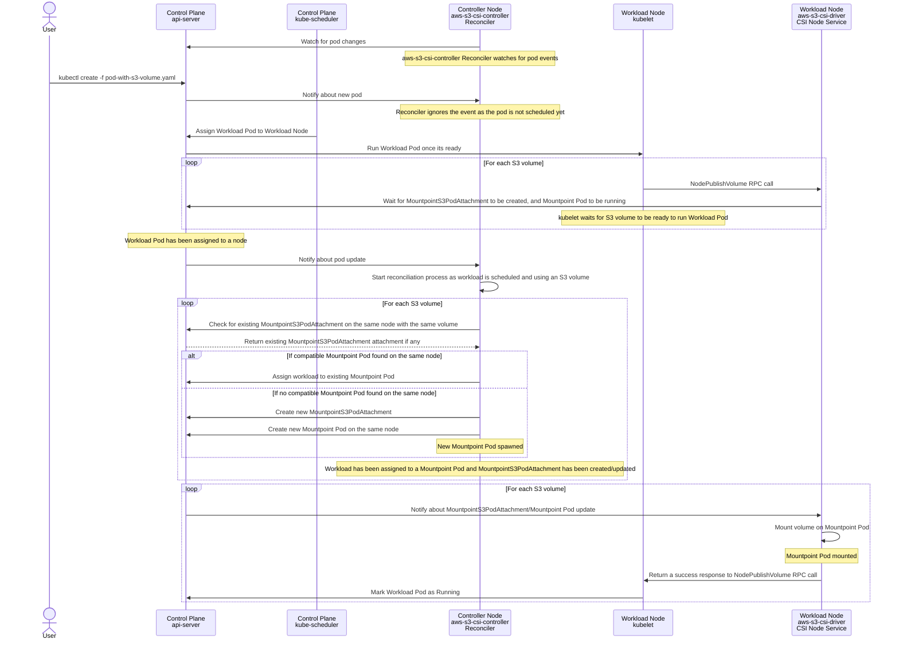
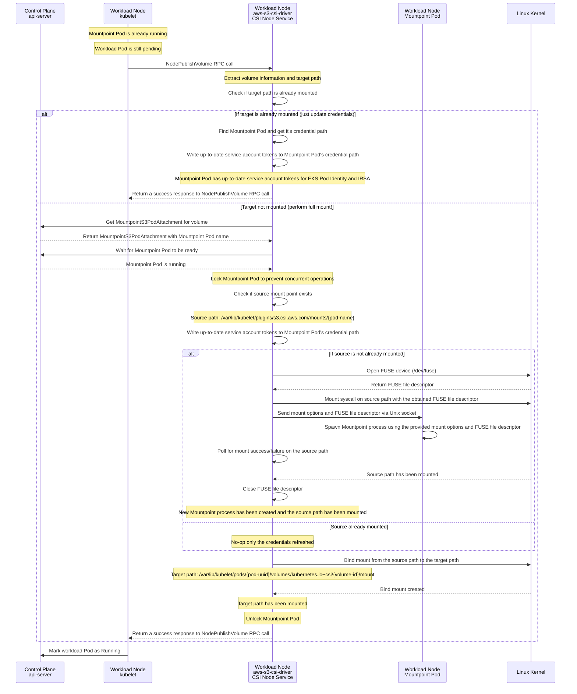
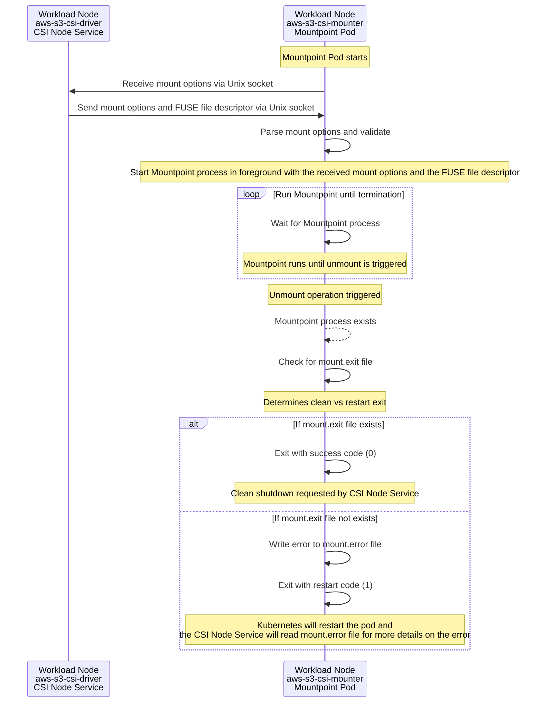

# Architecture of Mountpoint for Amazon S3 CSI Driver

The Mountpoint for Amazon S3 CSI Driver conforms to the [v1.9.0 version of Container Storage Interface (CSI)](https://github.com/container-storage-interface/spec/blob/v1.9.0/spec.md). The CSI Driver uses [Mountpoint for Amazon S3](https://github.com/awslabs/mountpoint-s3) under the hood to present an Amazon S3 bucket as a storage volume accessible by containers in your Kubernetes cluster.

The CSI Driver consists of three components deployed to your cluster.

## The Controller Component (`aws-s3-csi-controller`)

This component is deployed as a Pod in the cluster using a Deployment. It uses [controller-runtime](https://github.com/kubernetes-sigs/controller-runtime) to implement a Kubernetes controller. It’s responsible for watching newly scheduled workload Pods that use a volume backed by the CSI Driver and scheduling Mountpoint Pods to provide those volumes on the same node.

This component manages a [Custom Resource Definition (CRD)](https://kubernetes.io/docs/concepts/extend-kubernetes/api-extension/custom-resources/) called `MountpointS3PodAttachment`. The source-of-truth of which workload assigned to which Mountpoint Pod is stored using instances of this CRD. This component responsible for assignments and deassignments. This component decides when a Mountpoint Pod is no longer needed and marks it as such, notifying the Node Component to perform a clean exit.

This is what happens when there is a new workload using a volume backed by the CSI Driver scheduled to the cluster:

## The Node Component (`aws-s3-csi-driver`)

This component is deployed as a Pod to each node in the cluster using a DaemonSet. It implements [CSI Node Service RPC](https://github.com/container-storage-interface/spec/blob/master/spec.md#node-service-rpc) and registers itself with the kubelet running in that node using [sidecars provided by Kubernetes CSI project](https://kubernetes-csi.github.io/docs/sidecar-containers.html). This component implements two important RPCs from the CSI:

* `NodePublishVolume` – Called by kubelet whenever there is a Pod running in that node that uses a volume provided by the CSI Driver. In this method we coordinate Mountpoint Pod running in the same node for that volume and perform the mount operation to spawn a Mountpoint instance. This method also provides AWS credentials for Mountpoint instances. In the subsequent calls to this function, if the mount operation already performed for that volume, this function just updates previously created Service Account Tokens (for IRSA and EKS Pod Identity) to ensure Mountpoint instance has up-to-date tokens and can exchange them for temporary AWS credentials. To support [sharing Mountpoint Pods](#MOUNTPOINT_POD_SHARING.md), we create `bind` mounts to target Mountpoint Pods from each workload in this method after ensuring Mountpoint Pod is successfully mounted.

* `NodeUnpublishVolume` – Called by kubelet whenever the Pod using the volume is descheduled and the volume is no longer needed. This method unmounts `bind` mount created for each workload.

This component also registers itself with updates from the control plane to detect when a Mountpoint Pod is no longer needed. It performs unmount operation for Mountpoint to cleanly exit, and then it cleans all credential/token files to ensure there isn't any secret left.

This is what happens when kubelet calls `NodePublishVolume` on the node component:

## The Mounter Component / Mountpoint Pod (`aws-s3-csi-mounter`)

This component is deployed to cluster as Mountpoint Pods. It’s spawned by the controller component and responsible for receiving mount options from the node component and spawning Mountpoint instances inside the Pod and monitoring them. Mountpoint Pods runs without any privilege and also as a non-root user.

This is what happens inside a Mountpoint Pod when it starts running:

