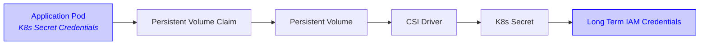

# Configuring the Mountpoint for Amazon S3 CSI Driver

See [the Mountpoint documentation](https://github.com/awslabs/mountpoint-s3/blob/main/doc/CONFIGURATION.md) for
Mountpoint specific configuration.

## Static Provisioning

The driver only supports Static Provisioning as of today, and you need an existing S3 Bucket to use.

To use Static Provisioning, you should set `storageClassName` field of your PersistentVolume (PV) and PersistentVolumeClaim (PVC) to `""` (empty string).
Also, in order to make sure no other PVCs can claim your PV, you should define a one-to-one mapping using `claimRef`:

```yaml
apiVersion: v1
kind: PersistentVolume
metadata:
  name: s3-pv
spec:
  ...
  storageClassName: "" # Required for static provisioning
  claimRef: # To ensure no other PVCs can claim this PV
    namespace: default # Namespace is required even though it's in "default" namespace.
    name: s3-pvc # Name of your PVC
  csi:
    driver: s3.csi.aws.com
    ...
---
apiVersion: v1
kind: PersistentVolumeClaim
metadata:
  name: s3-pvc
spec:
  ...
  storageClassName: "" # Required for static provisioning
  volumeName: s3-pv # Name of your PV
```

See [Reserving a PersistentVolume](https://kubernetes.io/docs/concepts/storage/persistent-volumes/#reserving-a-persistentvolume) for more details.

## AWS Credentials

<!-- TODO(S3CSI-17): Replace this section with Scality-specific authentication documentation.
This section originally contained AWS-specific IAM permissions information for S3 bucket access.
Need to document Scality CSI driver authentication requirements, permission policies, and setup instructions here. -->

The Mountpoint CSI Driver can be configured to ingest credentials via two approaches: globally for the entire
Kubernetes cluster, or using credentials assigned to pods.

### Driver-Level Credentials

<!-- TODO(S3CSI-17): Add/Update Driver-level credentials section for Scality IAM -->

### Driver-Level Credentials with K8s Secrets

Mountpoint CSI Driver supports sourcing static AWS credentials from K8s secrets.



The CSI driver will read K8s secrets at `aws-secret.key_id` and `aws-secret.access_key` to pass keys to the driver.
The secret name configurable if installing with helm: `awsAccessSecret.name`, and the installation namespace is
configurable with the `--namespace` helm parameter.

These keys are only read on startup, so must be in place before the driver starts.
The following snippet can be used to create these secrets in the cluster:

```
kubectl create secret generic aws-secret \
    --namespace kube-system \
    --from-literal "key_id=${AWS_ACCESS_KEY_ID}" \
    --from-literal "access_key=${AWS_SECRET_ACCESS_KEY}"
```

To use K8s secrets for authentication, the secret must exist before installation, or the CSI Driver pods must be
restarted to use the secret.

> [!WARNING]
> K8s secrets are not refreshed once read. To update long term credentials stored in K8s secrets, restart the CSI Driver pods.


### Pod-Level Credentials

> [!WARNING]
> To enable Pod-Level credentials on K8s clusters <1.30, you need to pass `node.podInfoOnMountCompat.enable=true` into
> your Helm installation.

You can configure Mountpoint CSI Driver to use the credentials associated with the pod's Service Account rather than the
driver's own credentials.

<!-- TODO(S3CSI-17) Add Pod level credentials doc-->

## Configure driver toleration settings
Toleration of all taints is set to `false` by default. If you don't want to deploy the driver on all nodes, add
policies to `Value.node.tolerations` to configure customized toleration for nodes.
