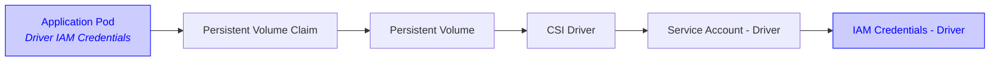
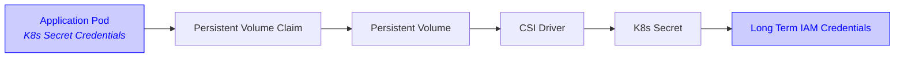
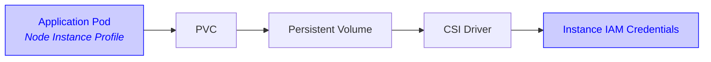
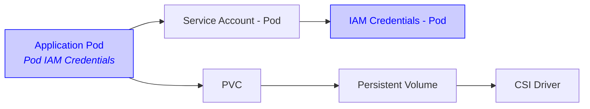
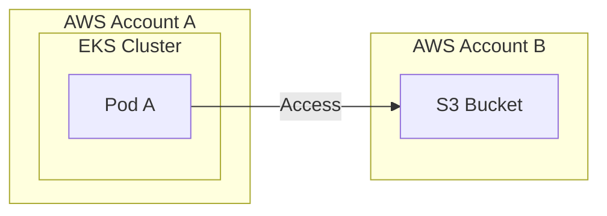

# Configuring the Mountpoint for Amazon S3 CSI Driver

See [the Mountpoint documentation](https://github.com/awslabs/mountpoint-s3/blob/main/doc/CONFIGURATION.md) for
Mountpoint specific configuration.

## Static Provisioning

The CSI driver supports only static provisioning for an existing S3 bucket.
Supported bucket types include general purpose, directory, and Outposts buckets.
In the 'bucketName' field, provide the full S3 bucket name.
For Outposts buckets, only access point ARN or alias is supported.

To use Static Provisioning, set the `storageClassName` field of your PersistentVolume (PV) and PersistentVolumeClaim (PVC) to `""` (an empty string).
To ensure no other PVCs can claim your PV, you should define a one-to-one mapping using `claimRef`:

```yaml
apiVersion: v1
kind: PersistentVolume
metadata:
  name: s3-pv
spec:
  ...
  storageClassName: "" # Required for static provisioning
  claimRef: # To ensure no other PVCs can claim this PV
    namespace: default # Namespace is required even though it's in "default" namespace.
    name: s3-pvc # Name of your PVC
  csi:
    driver: s3.csi.aws.com
    volumeHandle: s3-csi-driver-volume # Must be unique
    ...
    volumeAttributes:
      bucketName: amzn-s3-demo-bucket # Replace with your bucket name
---
apiVersion: v1
kind: PersistentVolumeClaim
metadata:
  name: s3-pvc
spec:
  ...
  storageClassName: "" # Required for static provisioning
  volumeName: s3-pv # Name of your PV
```

See [Reserving a PersistentVolume](https://kubernetes.io/docs/concepts/storage/persistent-volumes/#reserving-a-persistentvolume) for more details.

> [!IMPORTANT]
> Ensure that your volumeHandle is unique, since Kubernetes only processes a volume once per `volumeHandle`.
> If multiple PVs use the same `volumeHandle`, only one is processed.
> For more information, see ["I'm trying to use multiple S3 volumes in the same Pod but my Pod is stuck at `ContainerCreating` status"](./TROUBLESHOOTING.md#im-trying-to-use-multiple-s3-volumes-in-the-same-pod-but-my-pod-is-stuck-at-containercreating-status) in our troubleshooting guide.

## AWS Credentials

The driver requires IAM permissions to access your Amazon S3 bucket.
We recommend using [Mountpoint's suggested IAM permission policy](https://github.com/awslabs/mountpoint-s3/blob/main/doc/CONFIGURATION.md#iam-permissions).
Alternatively, you can use the AWS managed policy AmazonS3FullAccess, available at ARN
`arn:aws:iam::aws:policy/AmazonS3FullAccess`, but this managed policy grants more permissions than needed for the
Mountpoint CSI driver. For more details on creating a policy and an IAM role, review
["Creating an IAM policy"](https://docs.aws.amazon.com/eks/latest/userguide/s3-csi.html#s3-create-iam-policy) and
["Creating an IAM role"](https://docs.aws.amazon.com/eks/latest/userguide/s3-csi.html#s3-create-iam-role) from the
EKS User Guide.

The Mountpoint CSI Driver can be configured to ingest credentials via two approaches: globally for the entire
Kubernetes cluster, or using credentials assigned to pods.

### Driver-Level Credentials

By setting driver-level credentials, the whole cluster uses the same set of credentials.

Using this configuration, the credentials that are used are set at installation time, either using Service
Accounts, or using K8s secrets.

The CSI Driver uses the following load order for credentials:

1. K8s secrets (not recommended)
2. Driver-Level IRSA
3. Instance profiles


### Driver-Level Credentials with IRSA

Configuring [IAM Roles for Service Accounts](https://docs.aws.amazon.com/eks/latest/userguide/iam-roles-for-service-accounts.html) (IRSA)
is the recommended way to set up the CSI Driver if you want to use Driver-Level credentials.

This approach associates your AWS role to a Service Account used by the CSI Driver.
The role is then assumed by the CSI Driver for all volumes with a `driver` authentication source.



#### Service Account configuration for EKS Clusters

EKS allows using Kubernetes service accounts to authenticate requests to S3 using [IAM Roles for Service Accounts (IRSA)](https://docs.aws.amazon.com/eks/latest/userguide/iam-roles-for-service-accounts.html).
This is supported for both [driver-level identity](#driver-level-credentials-with-irsa)
and [pod-level identity](#pod-level-credentials).

The following sections describe how to create the supporting resources for IRSA with driver-level identity.

##### Create an IAM role for use by the CSI driver's service account

The following command will use `eksctl` to create the IAM role that will be used by the CSI driver's service account.
The service account is not created by this command, only the IAM role due to the `--role-only` option.
It will be created when the Mountpoint CSI driver is installed.

> [!IMPORTANT]
> The same service account name (`s3-csi-driver-sa`) must be specified both in this command and when creating a driver
> pod (in the pod spec `deploy/kubernetes/base/node-daemonset.yaml`, Helm value `node.serviceAccount.name`).

```
eksctl create iamserviceaccount \
    --name s3-csi-driver-sa \
    --namespace kube-system \
    --cluster $CLUSTER_NAME \
    --attach-policy-arn $ROLE_ARN \
    --approve \
    --role-name $ROLE_NAME \
    --region $REGION \
    --role-only
```

### Driver-Level Credentials with K8s Secrets

Where IAM Roles for Service Accounts (IRSA) isn't a viable option, Mountpoint CSI Driver also supports sourcing static
AWS credentials from K8s secrets.

> [!WARNING]
> We do not recommend using long-term AWS credentials. Instead, we recommend using short-term credentials with IRSA.




The CSI driver will read K8s secrets at `aws-secret.key_id` and `aws-secret.access_key` to pass keys to the driver.
The secret name configurable if installing with helm: `awsAccessSecret.name`, and the installation namespace is
configurable with the `--namespace` helm parameter.

These keys are only read on startup, so must be in place before the driver starts.
The following snippet can be used to create these secrets in the cluster:

```
kubectl create secret generic aws-secret \
    --namespace kube-system \
    --from-literal "key_id=${AWS_ACCESS_KEY_ID}" \
    --from-literal "access_key=${AWS_SECRET_ACCESS_KEY}"
```

To use K8s secrets for authentication, the secret must exist before installation, or the CSI Driver pods must be
restarted to use the secret.

> [!WARNING]
> K8s secrets are not refreshed once read. To update long term credentials stored in K8s secrets, restart the CSI Driver pods.


### Driver-Level Credentials with Node IAM Profiles

To use an IAM [instance profile](https://docs.aws.amazon.com/IAM/latest/UserGuide/id_roles_use_switch-role-ec2_instance-profiles.html),
attach the policy to the instance profile IAM role and turn on access to [instance metadata](https://docs.aws.amazon.com/AWSEC2/latest/UserGuide/ec2-instance-metadata.html)
for the instance(s) on which the driver will run.




### Pod-Level Credentials

> [!WARNING]
> To enable Pod-Level credentials on K8s clusters <1.30, you need to pass `node.podInfoOnMountCompat.enable=true` into
> your Helm installation.

You can configure Mountpoint CSI Driver to use the credentials associated with the pod's Service Account rather than the
driver's own credentials.

With this approach, a multi-tenant architecture is possible using [IAM Roles for Service Accounts](https://docs.aws.amazon.com/eks/latest/userguide/iam-roles-for-service-accounts.html) (IRSA).
Using Pod-Level Credentials with IRSA authentication allows the Mountpoint CSI Driver to use multiple credentials for
each pod.


> [!NOTE]
> If you configure a driver-level credential source when using `authenticationSource: pod`, it will be ignored.


> [!NOTE]
> Only IRSA is supported with Pod-Level credentials. You cannot configure K8s secrets or use instance profiles.




To configure the Mountpoint CSI Driver to use Pod-Level Credentials, configure your PV using `authenticationSource: pod`
in the `volumeAttributes` section:
```yaml
apiVersion: v1
kind: PersistentVolume
metadata:
  name: example-s3-pv
spec:
  capacity:
    storage: 1Gi
  accessModes:
    - ReadWriteMany
  mountOptions:
    - region us-east-1
  csi:
    driver: s3.csi.aws.com
    volumeHandle: example-s3-pv # Must be unique
    volumeAttributes:
      bucketName: amzn-s3-demo-bucket
      authenticationSource: pod # <-- HERE
```

Pods mounting the specified PV will use the pod's own Service Account for IRSA authentication.


#### Pod-Level Identity Service Account configuration for EKS Clusters

EKS allows using Kubernetes service accounts to authenticate requests to S3 using [IAM Roles for Service Accounts (IRSA)](https://docs.aws.amazon.com/eks/latest/userguide/iam-roles-for-service-accounts.html).
This is supported for both [driver-level identity](#driver-level-credentials-with-irsa)
and [pod-level identity](#pod-level-credentials).

The following sections describe how to create the supporting resources for IRSA with pod-level identity.

##### Create an IAM role for use by the pod's service account

The following command will use `eksctl` to create the IAM role that will be used by the pod's service account.
The service account is not created by this command, only the IAM role due to the `--role-only` option.

```
eksctl create iamserviceaccount \
    --name s3-pod-sa \
    --namespace $POD_NAMESPACE \
    --cluster $CLUSTER_NAME \
    --attach-policy-arn $ROLE_ARN \
    --approve \
    --role-name $ROLE_NAME \
    --region $REGION \
    --role-only
```

See the [example spec for pod-level identity](https://github.com/awslabs/mountpoint-s3-csi-driver/tree/main/examples/kubernetes/static_provisioning/pod_level_identity.yaml) for how to set up pod-level identity with IRSA.

### Configuring the STS region

In order to use Pod-Level credentials, the CSI Driver needs to know the STS region to request AWS credentials from.
The CSI Driver can normally automatically detect the current region to use as the STS region, but in case it can't,
either troubleshoot the automatic setup, or manually configure the volume's STS region.

#### Troubleshooting the automatic STS region detection

The S3 CSI Driver uses IMDS to detect the EC2 instance's region if not configured manually.
For this to function correctly, IMDS must be enabled on your cluster, and the `HttpPutResponseHopLimit` Metadata Option
must be 2 or greater.
You can detect what the current hop limit is with

`aws ec2 describe-instances --instance-ids i-123456789 --region aa-example-1`.

See the [AWS documentation](https://docs.aws.amazon.com/AWSEC2/latest/UserGuide/configuring-IMDS-new-instances.html#configure-IMDS-new-instances-instance-settings)
for how to configure the hop limit for new and existing instances.

#### Manually configuring the STS region

You can manually configure the STS region that's used for Pod-Level credentials with the `stsRegion` volume attribute.
This may be required in case the CSI Driver is unable to automatically configure a value.

```yaml
csi:
  driver: s3.csi.aws.com
  volumeHandle: example-s3-pv # Must be unique
  volumeAttributes:
    bucketName: amzn-s3-demo-bucket
    authenticationSource: pod
    stsRegion: us-east-1 # <-- HERE
```

Alternatively, the CSI Driver will detect the `--region` argument specified in the Mountpoint options.

## Configure driver toleration settings
Toleration of all taints is set to `false` by default. If you don't want to deploy the driver on all nodes, add
policies to `Value.node.tolerations` to configure customized toleration for nodes.

## Cross-account bucket access
You can grant access Amazon S3 buckets from different AWS accounts.
Combined with [Pod-Level Credentials](#pod-level-credentials), you have granularity to configure access to different S3 buckets from different AWS accounts in each Kubernetes Pod.

For example, to achieve the following setup:



| Resource      | ID                  |
| ------------- | ------------------- |
| AWS Account A | 111122223333        |
| AWS Account B | 444455556666        |
| S3 Bucket     | amzn-s3-demo-bucket |

You can either use bucket policies or cross-account IRSA to access the bucket.

### Cross-account bucket access using bucket policies
You can grant access Amazon S3 buckets from different AWS accounts using [bucket policies](https://docs.aws.amazon.com/AmazonS3/latest/userguide/bucket-policies.html).

1. Allow Pod A in AWS Account A (`111122223333`) to access S3 Bucket (`amzn-s3-demo-bucket`) in AWS Account B (`444455556666`)
  - Ensure Pod A and its Service Account have IRSA configured
    ```yaml
    apiVersion: v1
    kind: ServiceAccount
    metadata:
      name: pod-a-sa
      annotations:
        eks.amazonaws.com/role-arn: arn:aws:iam::111122223333:role/pod-a-role
    ---
    apiVersion: v1
    kind: Pod
    metadata:
      name: pod-a
    spec:
      serviceAccountName: pod-a-sa
    ```
  - Attach policy to `arn:aws:iam::111122223333:role/pod-a-role` to access S3 Bucket (`amzn-s3-demo-bucket`)
    ```json
    {
       "Version": "2012-10-17",
       "Statement": [
          {
             "Effect": "Allow",
             "Action": [
                "s3:ListBucket"
             ],
             "Resource": [
                "arn:aws:s3:::amzn-s3-demo-bucket"
             ]
          },
          {
             "Effect": "Allow",
             "Action": [
                "s3:GetObject"
             ],
             "Resource": [
                "arn:aws:s3:::amzn-s3-demo-bucket/*"
             ]
          }
       ]
    }
    ```

2. Attach a bucket policy to S3 Bucket (`amzn-s3-demo-bucket`) in AWS Account B (`444455556666`) to grant permissions for Pod A in AWS Account A (`111122223333`)
```json
{
    "Version": "2012-10-17",
    "Statement": [
        {
            "Effect": "Allow",
            "Principal": {
                "AWS": "arn:aws:iam::111122223333:root"
            },
            "Condition": {
                "StringEquals": {
                    "aws:FederatedProvider": "arn:aws:iam::111122223333:oidc-provider/oidc.eks.region-code.amazonaws.com/id/EXAMPLED539D4633E53DE1B71EXAMPLE",
                    "aws:PrincipalArn": "arn:aws:iam::111122223333:role/pod-a-role"
                }
            },
            "Action": "s3:ListBucket",
            "Resource": "arn:aws:s3:::amzn-s3-demo-bucket"
        },
        {
            "Effect": "Allow",
            "Principal": {
                "AWS": "arn:aws:iam::111122223333:root"
            },
            "Condition": {
                "StringEquals": {
                    "aws:FederatedProvider": "arn:aws:iam::111122223333:oidc-provider/oidc.eks.region-code.amazonaws.com/id/EXAMPLED539D4633E53DE1B71EXAMPLE",
                    "aws:PrincipalArn": "arn:aws:iam::111122223333:role/pod-a-role"
                }
            },
            "Action": "s3:GetObject",
            "Resource": "arn:aws:s3:::amzn-s3-demo-bucket/*"
        }
    ]
}
```
This policy only allows `arn:aws:iam::111122223333:role/pod-a-role` when it's assumed with `AssumeRoleWithWebIdentity` (i.e., IRSA),
assuming only Pod A in AWS Account A (`111122223333`) is allowed to assume this role, it only allows Pod A in AWS Account A (`111122223333`) to access this bucket.
See [AWS global condition context keys](https://docs.aws.amazon.com/IAM/latest/UserGuide/reference_policies_condition-keys.html) for more details on conditions you can use.

### Cross-account bucket access using IRSA with an identity provider from a different account
You can grant access Amazon S3 buckets from different AWS accounts by using IRSA.
See [Authenticate to another account with IRSA](https://docs.aws.amazon.com/eks/latest/userguide/cross-account-access.html) for more details.

1. [Create an IAM OIDC provider](https://docs.aws.amazon.com/eks/latest/userguide/enable-iam-roles-for-service-accounts.html) in AWS Account B (`444455556666`) for the cluster in AWS Account A (`111122223333`).

2. Create and assign an IAM role in AWS Account B (`444455556666`) that trusts the cluster and the Pod in AWS Account A (`111122223333`)
  - Follow [Assign IAM roles to Kubernetes service accounts](https://docs.aws.amazon.com/eks/latest/userguide/associate-service-account-role.html) to configure the IAM role.
    Ensure to add permissions to access S3 Bucket (`amzn-s3-demo-bucket`).
