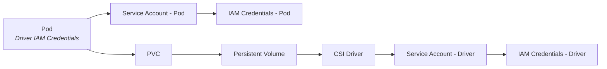
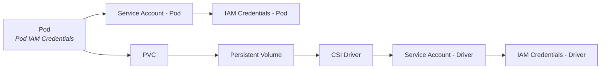

# Configuring the Mountpoint for Amazon S3 CSI Driver

See [the Mountpoint documentation](https://github.com/awslabs/mountpoint-s3/blob/main/doc/CONFIGURATION.md) for
Mountpoint specific configuration.

## AWS Credentials

The Mountpoint CSI Driver can be configured to ingest credentials via two approaches: globally for the entire 
Kubernetes cluster, or using credentials assigned to pods.

### Driver Level Credentials

By setting driver-level credentials, the whole cluster uses the same set of credentials. 

Using this configuration, the credentials that are used are set at installation time, either using Service
Accounts, or using K8s secrets. 

See [install.md](./install.md) for more details on this approach.

**TODO** - Migrate driver level setup here.



### Pod Level Credentials

Alternatively, you can configure the CSI Driver to use a pod's Service Account on your volumes. 
With this approach, a multi-tenant architecture is possible using [IAM Roles for Service Accounts](https://docs.aws.amazon.com/eks/latest/userguide/iam-roles-for-service-accounts.html) (IRSA).
Using Pod Level Credentials with IRSA authentication allows the Mountpoint CSI Driver to use multiple credentials for
each pod. 



To configure the Mountpoint CSI Driver to use Pod Level Credentials, configure your PV using `authenticationSource: pod`
in the `volumeAttributes` section:
```yaml
apiVersion: v1
kind: PersistentVolume
metadata:
  name: example-s3-pv
spec:
  capacity:
    storage: 1Gi
  accessModes:
    - ReadWriteMany
  mountOptions:
    - region us-east-1
  csi:
    driver: s3.csi.aws.com
    volumeHandle: example-s3-pv
    volumeAttributes:
      bucketName: amzn-s3-demo-bucket
      authenticationSource: pod
```

Pods mounting the specified PV will use the pod's own Service Account for IRSA authentication.

