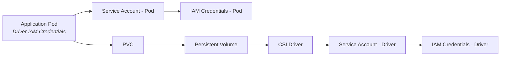
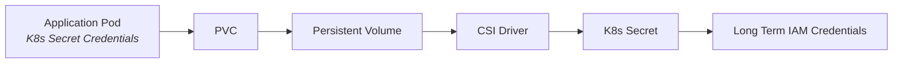
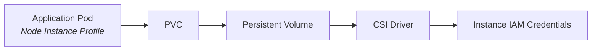
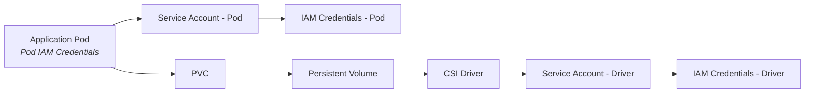

# Configuring the Mountpoint for Amazon S3 CSI Driver

See [the Mountpoint documentation](https://github.com/awslabs/mountpoint-s3/blob/main/doc/CONFIGURATION.md) for
Mountpoint specific configuration.

## AWS Credentials

The Mountpoint CSI Driver can be configured to ingest credentials via two approaches: globally for the entire 
Kubernetes cluster, or using credentials assigned to pods.

### Driver Level Credentials

By setting driver-level credentials, the whole cluster uses the same set of credentials. 

Using this configuration, the credentials that are used are set at installation time, either using Service
Accounts, or using K8s secrets. 

See [install.md](./install.md) for more details on this approach.

**TODO** - Migrate driver level setup here.

### Driver Level Credentials with IRSA

Configuring [IAM Roles for Service Accounts](https://docs.aws.amazon.com/eks/latest/userguide/iam-roles-for-service-accounts.html) (IRSA)
is the recommended way to set up the CSI Driver if you want to use Driver Level credentials.



### Driver Level Credentials with K8s Secrets

The Mountpoint CSI Driver also supports sourcing long term AWS credentials from k8s secrets, though this is not 
recommended.



By default, the CSI Driver checks the existence of a secret `aws-secret` in the installation namespace 
(default `kube-system`). 
The secret name configurable if installing with helm: `awsAccessSecret.name`, and the installation namespace is 
configurable with the `--namespace` helm parameter.

```bash
kubectl create secret generic aws-secret \
    --namespace kube-system \
    --from-literal "key_id=${AWS_ACCESS_KEY_ID}" \
    --from-literal "access_key=${AWS_SECRET_ACCESS_KEY}"
```

To use K8s secrets for authentication, the secret must exist before installation, or the CSI Driver pods must be 
restarted to use the secret.

### Driver Level Credentials with Node IAM Profiles

To use an IAM [instance profile](https://docs.aws.amazon.com/IAM/latest/UserGuide/id_roles_use_switch-role-ec2_instance-profiles.html),
attach the policy to the instance profile IAM role and turn on access to [instance metadata](https://docs.aws.amazon.com/AWSEC2/latest/UserGuide/ec2-instance-metadata.html)
for the instance(s) on which the driver will run.




## Pod Level Credentials

Alternatively, you can configure the CSI Driver to use a pod's Service Account on your volumes. 
With this approach, a multi-tenant architecture is possible using [IAM Roles for Service Accounts](https://docs.aws.amazon.com/eks/latest/userguide/iam-roles-for-service-accounts.html) (IRSA).
Using Pod Level Credentials with IRSA authentication allows the Mountpoint CSI Driver to use multiple credentials for
each pod. 



To configure the Mountpoint CSI Driver to use Pod Level Credentials, configure your PV using `authenticationSource: pod`
in the `volumeAttributes` section:
```yaml
apiVersion: v1
kind: PersistentVolume
metadata:
  name: example-s3-pv
spec:
  capacity:
    storage: 1Gi
  accessModes:
    - ReadWriteMany
  mountOptions:
    - region us-east-1
  csi:
    driver: s3.csi.aws.com
    volumeHandle: example-s3-pv
    volumeAttributes:
      bucketName: amzn-s3-demo-bucket
      authenticationSource: pod
```

Pods mounting the specified PV will use the pod's own Service Account for IRSA authentication.

