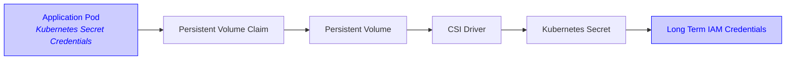
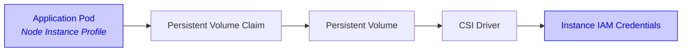
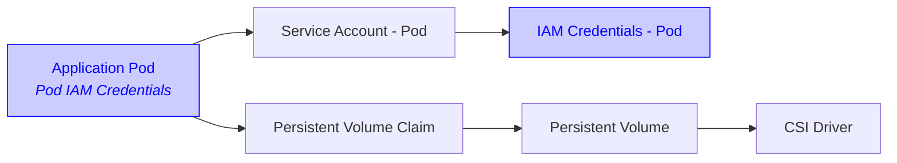

# Configuring the Mountpoint for Amazon S3 CSI Driver

This document covers how to configure the CSI driver: be it through driver install-time configuration or in the volume specs.

## Mountpoint-specific configuration

Most Mountpoint-specific configuration can be found in [the Mountpoint documentation](https://github.com/awslabs/mountpoint-s3/blob/main/doc/CONFIGURATION.md) and should be specified as `mountOptions`.
One notable exception is for Mountpoint's local data caching, which should be specified using volume attributes. See the dedicated [Mountpoint S3 CSI driver caching documentation](https://github.com/awslabs/mountpoint-s3-csi-driver/blob/main/docs/CACHING.md) for more information on cache configuration.

Common options that can be passed directly to Mountpoint via `mountOptions` include:

- `--prefix` to mount only a specific prefix within your bucket
- `--maximum-throughput-gbps` to hint desired bandwidth usage
- `--write-part-size` to adjust upload part sizes

Below shows an example `mountOptions` value for these options

```yaml
mountOptions:
  - prefix some-prefix/
  - maximum-throughput-gbps 25
  - write-part-size 16777216
```

> [!IMPORTANT]
> Mount options are passed directly to Mountpoint without shell interpretation.
> Unlike in a shell, quoted strings like `"my value"` are treated as a literal quoted value
> rather than as a way to group words with spaces.
> For example, if you wish to be pass an argument to Mountpoint like `--prefix="hello world/"`,
> you should use the mount option `prefix hello world/`.

See [the Mountpoint documentation](https://github.com/awslabs/mountpoint-s3/blob/main/doc/CONFIGURATION.md) for all available configuration options.

## Static Provisioning

The CSI driver supports only static provisioning for an existing S3 bucket.
Supported bucket types include general purpose, directory, and Outposts buckets.
In the 'bucketName' field, provide the full S3 bucket name.
For Outposts buckets, only access point ARN or alias is supported.

To use Static Provisioning, set the `storageClassName` field of your PersistentVolume (PV) and PersistentVolumeClaim (PVC) to `""` (an empty string).
To ensure no other PVCs can claim your PV, you should define a one-to-one mapping using `claimRef`:

```yaml
apiVersion: v1
kind: PersistentVolume
metadata:
  name: s3-pv
spec:
  accessModes:
    - ReadWriteMany     # Supported options: ReadWriteMany / ReadOnlyMany
  capacity:
    storage: 1200Gi     # Value is ignored but required by Kubernetes
  storageClassName: ""  # Empty string required for static provisioning
  claimRef:             # To ensure no other PVCs can claim this PV
    namespace: default  # Namespace is required even though it's in "default" namespace.
    name: s3-pvc        # Name of your PVC
  mountOptions:         # Optional: Configure Mountpoint for Amazon S3 flags
    - region us-east-1  # See https://github.com/awslabs/mountpoint-s3/blob/main/doc/CONFIGURATION.md for all options
  csi:
    driver: s3.csi.aws.com
    volumeHandle: s3-csi-driver-volume  # Must be unique
    volumeAttributes:
      # ----- BUCKET CONFIGURATION -----
      bucketName: amzn-s3-demo-bucket   # Required: S3 bucket name or ARN (for Outpost)

      # ----- AUTHENTICATION CONFIGURATION -----
      # See more details in https://github.com/awslabs/mountpoint-s3-csi-driver/blob/main/docs/CONFIGURATION.md#aws-credentials
      authenticationSource: driver      # Optional: Authentication source [driver (default) | pod]
      stsRegion: us-east-1              # Optional: Region for AWS STS endpoint when using pod-level identity with IRSA

      # ----- LOCAL CACHE CONFIGURATION -----
      # See more details in https://github.com/awslabs/mountpoint-s3-csi-driver/blob/main/docs/CACHING.md
      cache: emptyDir                   # Optional: Local cache type [emptyDir | ephemeral]. Default: no local cache.

      # emptyDir cache options:
      cacheEmptyDirSizeLimit: 1Gi       # Optional: Maximum size for emptyDir cache
      cacheEmptyDirMedium: ""           # Optional: Storage medium ["" (default) | Memory]

      # ephemeral cache options (both required if `cache: ephemeral`):
      cacheEphemeralStorageClassName: gp2       # Storage class for ephemeral cache volume
      cacheEphemeralStorageResourceRequest: 1Gi # Size of the ephemeral cache volume

      # ----- RESOURCE CONFIGURATION -----
      # Optional: Configure Mountpoint container resource requests/limits
      mountpointContainerResourcesRequestsCpu: 500m
      mountpointContainerResourcesRequestsMemory: 1Gi
      mountpointContainerResourcesLimitsCpu: 500m
      mountpointContainerResourcesLimitsMemory: 1Gi

---
apiVersion: v1
kind: PersistentVolumeClaim
metadata:
  name: s3-pvc         # Must match name referenced in PV's claimRef
spec:
  accessModes:
    - ReadWriteMany    # Supported options: ReadWriteMany / ReadOnlyMany
  storageClassName: "" # Empty string required for static provisioning
  resources:
    requests:
      storage: 1200Gi  # Value is ignored but required by Kubernetes
  volumeName: s3-pv    # Must match the name of your PV
```

See [Reserving a PersistentVolume](https://kubernetes.io/docs/concepts/storage/persistent-volumes/#reserving-a-persistentvolume) for more details.

> [!IMPORTANT]
> Ensure that your volumeHandle is unique, since Kubernetes only processes a volume once per `volumeHandle`.
> If multiple PVs use the same `volumeHandle`, only one is processed.
> For more information, see ["I'm trying to use multiple S3 volumes in the same Pod but my Pod is stuck at `ContainerCreating` status"](./TROUBLESHOOTING.md#im-trying-to-use-multiple-s3-volumes-in-the-same-pod-but-my-pod-is-stuck-at-containercreating-status) in our troubleshooting guide.

## AWS Credentials

The driver requires IAM permissions to access your Amazon S3 bucket.
We recommend using [Mountpoint's suggested IAM permission policy](https://github.com/awslabs/mountpoint-s3/blob/main/doc/CONFIGURATION.md#iam-permissions).
Alternatively, you can use the AWS managed policy AmazonS3FullAccess, available at ARN
`arn:aws:iam::aws:policy/AmazonS3FullAccess`, but this managed policy grants more permissions than needed for the
Mountpoint CSI driver. For more details on creating a policy and an IAM role, review
["Creating an IAM policy"](https://docs.aws.amazon.com/eks/latest/userguide/s3-csi.html#s3-create-iam-policy) and
["Creating an IAM role"](https://docs.aws.amazon.com/eks/latest/userguide/s3-csi.html#s3-create-iam-role) from the
EKS User Guide.

The Mountpoint CSI Driver can be configured to ingest credentials via two approaches: globally for the entire
Kubernetes cluster, or using credentials assigned to pods.

### Driver-Level Credentials

By setting driver-level credentials, the whole cluster uses the same set of credentials.

Using this configuration, the credentials that are used are set at installation time, either using Service
Accounts, or using Kubernetes secrets.

The CSI Driver uses the following load order for credentials:

1. Kubernetes secrets (not recommended)
2. Driver-Level IAM Roles for Service Accounts (IRSA)
3. Driver-Level EKS Pod Identity
4. Instance profiles

### Driver-Level Credentials with EKS Pod Identity

Configuring [EKS Pod Identity](https://docs.aws.amazon.com/eks/latest/userguide/pod-identities.html) is the recommended way to set up the CSI Driver if you want to use Driver-Level credentials in an EKS Cluster.
For non-EKS clusters, see [Driver-Level Credentials with IRSA](#driver-level-credentials-with-irsa).

This approach associates your AWS IAM role to a Service Account used by the CSI Driver. The role is then assumed by the Mountpoint Pod for all volumes with a `driver` authentication source.


#### Service Account configuration for EKS Clusters

EKS allows using Kubernetes service accounts to authenticate requests to S3 using [EKS Pod Identity](https://docs.aws.amazon.com/eks/latest/userguide/pod-identities.html).
This is supported for both [driver-level identity](#driver-level-credentials-with-eks-pod-identity) and [pod-level identity](#pod-level-credentials).

To create the supporting resources for EKS Pod Identity with driver-level identity:
1. [Set up the Amazon EKS Pod Identity Agent](https://docs.aws.amazon.com/eks/latest/userguide/pod-id-agent-setup.html)
2. Create a Pod Identity association for the service account `s3-csi-driver-sa` by following the [Assign an IAM role to a Kubernetes service account](https://docs.aws.amazon.com/eks/latest/userguide/pod-id-association.html) documentation.
3. [Configure Pods to access AWS services with service accounts](https://docs.aws.amazon.com/eks/latest/userguide/pod-id-configure-pods.html)

### Driver-Level Credentials with IRSA

Configuring [IAM Roles for Service Accounts (IRSA)](https://docs.aws.amazon.com/eks/latest/userguide/iam-roles-for-service-accounts.html) is the recommended way to set up the CSI Driver if you want to use Driver-Level credentials in a non-EKS Cluster.
For EKS clusters, see [Driver-Level Credentials with EKS Pod Identity](#driver-level-credentials-with-eks-pod-identity).

This approach associates your AWS role to a Service Account used by the CSI Driver. The role is then assumed by the CSI Driver for all volumes with a `driver` authentication source.


#### Service Account configuration for EKS Clusters

EKS allows using Kubernetes service accounts to authenticate requests to S3 using [IAM Roles for Service Accounts (IRSA)](https://docs.aws.amazon.com/eks/latest/userguide/iam-roles-for-service-accounts.html).
This is supported for both [driver-level identity](#driver-level-credentials-with-irsa) and [pod-level identity](#pod-level-credentials).

The following section describes how to create the supporting resources for IRSA with driver-level identity.

##### Create an IAM role for use by the CSI driver's service account

The following command will use `eksctl` to create the IAM role that will be used by the CSI driver's service account.
The service account is not created by this command, only the IAM role due to the `--role-only` option.
It will be created when the Mountpoint CSI driver is installed.

> [!IMPORTANT]
> The same service account name (`s3-csi-driver-sa`) must be specified both in this command and when creating a driver
> pod (in the pod spec `deploy/kubernetes/base/node-daemonset.yaml`, Helm value `node.serviceAccount.name`).

```
eksctl create iamserviceaccount \
    --name s3-csi-driver-sa \
    --namespace kube-system \
    --cluster $CLUSTER_NAME \
    --attach-policy-arn $ROLE_ARN \
    --approve \
    --role-name $ROLE_NAME \
    --region $REGION \
    --role-only
```

### Driver-Level Credentials with Kubernetes Secrets

For cases where EKS Pod Identity and IAM Roles for Service Accounts (IRSA) are not viable options, Mountpoint CSI Driver also supports sourcing static AWS credentials from Kubernetes secrets.

> [!WARNING]
> We do not recommend using long-term AWS credentials. Instead, we recommend using short-term credentials with EKS Pod Identity or IRSA.




The CSI driver will read Kubernetes secrets at `aws-secret.key_id` and `aws-secret.access_key` to pass keys to the driver.
The secret name configurable if installing with helm: `awsAccessSecret.name`, and the installation namespace is
configurable with the `--namespace` helm parameter.

These keys are only read on startup, so must be in place before the driver starts.
The following snippet can be used to create these secrets in the cluster:

```
kubectl create secret generic aws-secret \
    --namespace kube-system \
    --from-literal "key_id=${AWS_ACCESS_KEY_ID}" \
    --from-literal "access_key=${AWS_SECRET_ACCESS_KEY}"
```

To use Kubernetes secrets for authentication, the secret must exist before installation, or the CSI Driver pods must be
restarted to use the secret.

> [!WARNING]
> Kubernetes secrets are not refreshed once read. To update long term credentials stored in Kubernetes secrets, restart the CSI Driver pods.


### Driver-Level Credentials with Node IAM Profiles

> [!NOTE]
> This method relies on [Instance Metadata Service (IMDS)](https://docs.aws.amazon.com/AWSEC2/latest/UserGuide/configuring-instance-metadata-service.html), and you need to make sure IMDS is accessible by the CSI Driver pods. See [configure the Instance Metadata Service](https://docs.aws.amazon.com/AWSEC2/latest/UserGuide/configuring-instance-metadata-options.html) for more details on making IMDS accessible.

To use an IAM [instance profile](https://docs.aws.amazon.com/IAM/latest/UserGuide/id_roles_use_switch-role-ec2_instance-profiles.html),
attach the policy to the instance profile IAM role and turn on access to [instance metadata](https://docs.aws.amazon.com/AWSEC2/latest/UserGuide/ec2-instance-metadata.html)
for the instance(s) on which the driver will run.




### Pod-Level Credentials

You can configure Mountpoint CSI Driver to use the credentials associated with the pod's Service Account rather than the
driver's own credentials.

With this approach, a multi-tenant architecture is possible using [EKS Pod Identity](https://docs.aws.amazon.com/eks/latest/userguide/pod-identities.html) or [IAM Roles for Service Accounts (IRSA)](https://docs.aws.amazon.com/eks/latest/userguide/iam-roles-for-service-accounts.html).
Using Pod-Level Credentials with EKS Pod Identity or IRSA authentication allows the Mountpoint CSI Driver to use multiple credentials for each pod.

Configuring [EKS Pod Identity](https://docs.aws.amazon.com/eks/latest/userguide/pod-identities.html) is the recommended way to set up the CSI Driver if you want to use Pod-Level credentials in an EKS Cluster.
For non-EKS clusters, [IAM Roles for Service Accounts (IRSA)](https://docs.aws.amazon.com/eks/latest/userguide/iam-roles-for-service-accounts.html) can be used instead.


> [!NOTE]
> If you configure a driver-level credential source when using `authenticationSource: pod`, it will be ignored.


> [!NOTE]
> Only EKS Pod Identity and IRSA are supported with Pod-Level credentials. You cannot configure Kubernetes secrets or use instance profiles.




To configure the Mountpoint CSI Driver to use Pod-Level Credentials, configure your PV using `authenticationSource: pod`
in the `volumeAttributes` section:
```yaml
apiVersion: v1
kind: PersistentVolume
metadata:
  name: example-s3-pv
spec:
  capacity:
    storage: 1Gi
  accessModes:
    - ReadWriteMany
  mountOptions:
    - region us-east-1
  csi:
    driver: s3.csi.aws.com
    volumeHandle: example-s3-pv # Must be unique
    volumeAttributes:
      bucketName: amzn-s3-demo-bucket
      authenticationSource: pod # <-- HERE
```

Pods mounting the specified PV will use the pod's own Service Account for EKS Pod Identity or IRSA authentication.


#### Pod-Level Identity Service Account configuration for EKS Clusters

EKS allows using Kubernetes service accounts to authenticate requests to S3 using [EKS Pod Identity](https://docs.aws.amazon.com/eks/latest/userguide/pod-identities.html) or [IAM Roles for Service Accounts (IRSA)](https://docs.aws.amazon.com/eks/latest/userguide/iam-roles-for-service-accounts.html).
This is supported for both [driver-level identity](#driver-level-credentials-with-eks-pod-identity) and [pod-level identity](#pod-level-credentials).

To setup the supporting resources for EKS Pod Identity with pod-level identity:
1. [Set up the Amazon EKS Pod Identity Agent](https://docs.aws.amazon.com/eks/latest/userguide/pod-id-agent-setup.html)
2. Create a Pod Identity association for the pod's service account by following the [Assign an IAM role to a Kubernetes service account](https://docs.aws.amazon.com/eks/latest/userguide/pod-id-association.html) documentation.
3. [Configure Pods to access AWS services with service accounts](https://docs.aws.amazon.com/eks/latest/userguide/pod-id-configure-pods.html)

To setup the supporting resources for IRSA with pod-level identity, create an IAM role for use by the pod's service account:

The following command will use `eksctl` to create the IAM role that will be used by the pod's service account.
The service account is not created by this command, only the IAM role due to the `--role-only` option.

```
eksctl create iamserviceaccount \
    --name s3-pod-sa \
    --namespace $POD_NAMESPACE \
    --cluster $CLUSTER_NAME \
    --attach-policy-arn $ROLE_ARN \
    --approve \
    --role-name $ROLE_NAME \
    --region $REGION \
    --role-only
```

See the [example spec for pod-level identity](https://github.com/awslabs/mountpoint-s3-csi-driver/tree/main/examples/kubernetes/static_provisioning/pod_level_identity.yaml) for how to set up pod-level identity.

### Configuring the STS region

In order to use Pod-Level credentials with IRSA, the CSI Driver needs to know the STS region to request AWS credentials from.
The CSI Driver can normally automatically detect the current region to use as the STS region, but in case it can't,
either troubleshoot the automatic setup, or manually configure the volume's STS region.

#### Troubleshooting the automatic STS region detection

The S3 CSI Driver uses IMDS to detect the EC2 instance's region if not configured manually.
For this to function correctly, IMDS must be enabled on your cluster, and the `HttpPutResponseHopLimit` Metadata Option
must be 2 or greater.
You can detect what the current hop limit is with

`aws ec2 describe-instances --instance-ids i-123456789 --region aa-example-1`.

See the [AWS documentation](https://docs.aws.amazon.com/AWSEC2/latest/UserGuide/configuring-IMDS-new-instances.html#configure-IMDS-new-instances-instance-settings)
for how to configure the hop limit for new and existing instances.

#### Manually configuring the STS region

You can manually configure the STS region that's used for Pod-Level credentials with the `stsRegion` volume attribute.
This may be required in case the CSI Driver is unable to automatically configure a value.

```yaml
csi:
  driver: s3.csi.aws.com
  volumeHandle: example-s3-pv # Must be unique
  volumeAttributes:
    bucketName: amzn-s3-demo-bucket
    authenticationSource: pod
    stsRegion: us-east-1 # <-- HERE
```

Alternatively, the CSI Driver will detect the `--region` argument specified in the Mountpoint options.

## Configure driver toleration settings
Toleration of all taints for the node daemon is set to `true` by default. If you don't want to deploy the driver on all nodes, add
policies to `Value.node.tolerations` to configure customized toleration for nodes.

## Configure node startup taint
There are potential race conditions on node startup (especially when a node is first joining the cluster) where pods/processes that rely on the Mountpoint CSI Driver can act on a node before the Mountpoint CSI Driver is able to startup up and become fully ready. To combat this, the Mountpoint CSI Driver contains a feature to automatically remove a taint from the node on startup. Users can taint their nodes when they join the cluster and/or on startup, to prevent other pods from running and/or being scheduled on the node prior to the Mountpoint CSI Driver becoming ready.

This feature is activated by default, and cluster administrators should use the taint `s3.csi.aws.com/agent-not-ready:NoExecute` (any effect will work, but `NoExecute` is recommended). For example, EKS Managed Node Groups [support automatically tainting nodes](https://docs.aws.amazon.com/eks/latest/userguide/node-taints-managed-node-groups.html).

## Cross-account bucket access
Mountpoint's CSI driver supports cross-account bucket access.
Combined with [Pod-Level Credentials](#pod-level-credentials), you have granularity to configure access to different S3 buckets from different AWS accounts in each Kubernetes Pod.

For example, to achieve the following setup:


| Resource      | ID                  |
| ------------- | ------------------- |
| AWS Account A | 111122223333        |
| AWS Account B | 444455556666        |
| S3 Bucket     | amzn-s3-demo-bucket |

You can either use bucket policies or cross-account EKS Pod Identity/IRSA to access the bucket.

### Cross-account bucket access using bucket policies
You can grant access Amazon S3 buckets from different AWS accounts using [bucket policies](https://docs.aws.amazon.com/AmazonS3/latest/userguide/bucket-policies.html).

1. Allow Pod A in AWS Account A (`111122223333`) to access S3 Bucket (`amzn-s3-demo-bucket`) in AWS Account B (`444455556666`)
  - Ensure Pod A and its Service Account have EKS Pod Identity or IRSA configured
    ```yaml
    apiVersion: v1
    kind: ServiceAccount
    metadata:
      name: pod-a-sa
      annotations:
        eks.amazonaws.com/role-arn: arn:aws:iam::111122223333:role/pod-a-role
    ---
    apiVersion: v1
    kind: Pod
    metadata:
      name: pod-a
    spec:
      serviceAccountName: pod-a-sa
    ```
  - Attach policy to `arn:aws:iam::111122223333:role/pod-a-role` to access S3 Bucket (`amzn-s3-demo-bucket`)
    ```json
    {
       "Version": "2012-10-17",
       "Statement": [
          {
             "Effect": "Allow",
             "Action": [
                "s3:ListBucket"
             ],
             "Resource": [
                "arn:aws:s3:::amzn-s3-demo-bucket"
             ]
          },
          {
             "Effect": "Allow",
             "Action": [
                "s3:GetObject"
             ],
             "Resource": [
                "arn:aws:s3:::amzn-s3-demo-bucket/*"
             ]
          }
       ]
    }
    ```

2. Attach a bucket policy to S3 Bucket (`amzn-s3-demo-bucket`) in AWS Account B (`444455556666`) to grant permissions for Pod A in AWS Account A (`111122223333`)
```json
{
    "Version": "2012-10-17",
    "Statement": [
        {
            "Effect": "Allow",
            "Principal": {
                "AWS": "arn:aws:iam::111122223333:root"
            },
            "Condition": {
                "StringEquals": {
                    "aws:FederatedProvider": "arn:aws:iam::111122223333:oidc-provider/oidc.eks.region-code.amazonaws.com/id/EXAMPLED539D4633E53DE1B71EXAMPLE",
                    "aws:PrincipalArn": "arn:aws:iam::111122223333:role/pod-a-role"
                }
            },
            "Action": "s3:ListBucket",
            "Resource": "arn:aws:s3:::amzn-s3-demo-bucket"
        },
        {
            "Effect": "Allow",
            "Principal": {
                "AWS": "arn:aws:iam::111122223333:root"
            },
            "Condition": {
                "StringEquals": {
                    "aws:FederatedProvider": "arn:aws:iam::111122223333:oidc-provider/oidc.eks.region-code.amazonaws.com/id/EXAMPLED539D4633E53DE1B71EXAMPLE",
                    "aws:PrincipalArn": "arn:aws:iam::111122223333:role/pod-a-role"
                }
            },
            "Action": "s3:GetObject",
            "Resource": "arn:aws:s3:::amzn-s3-demo-bucket/*"
        }
    ]
}
```
This policy only allows `arn:aws:iam::111122223333:role/pod-a-role` when it's assumed with `AssumeRoleWithWebIdentity` (i.e., EKS Pod Identity, IRSA),
assuming only Pod A in AWS Account A (`111122223333`) is allowed to assume this role, it only allows Pod A in AWS Account A (`111122223333`) to access this bucket.
See [AWS global condition context keys](https://docs.aws.amazon.com/IAM/latest/UserGuide/reference_policies_condition-keys.html) for more details on conditions you can use.


### Cross-account bucket access using EKS Pod Identity
You can grant access Amazon S3 buckets from different AWS accounts by using EKS Pod Identity.
See "How to perform cross account access with Amazon EKS Pod Identity" section in [Amazon EKS Pod Identity: a new way for applications on EKS to obtain IAM credentials](https://aws.amazon.com/blogs/containers/amazon-eks-pod-identity-a-new-way-for-applications-on-eks-to-obtain-iam-credentials) for more details.


### Cross-account bucket access using IRSA with an identity provider from a different account
You can grant access Amazon S3 buckets from different AWS accounts by using IRSA.
See [Authenticate to another account with IRSA](https://docs.aws.amazon.com/eks/latest/userguide/cross-account-access.html) for more details.

1. [Create an IAM OIDC provider](https://docs.aws.amazon.com/eks/latest/userguide/enable-iam-roles-for-service-accounts.html) in AWS Account B (`444455556666`) for the cluster in AWS Account A (`111122223333`).

2. Create and assign an IAM role in AWS Account B (`444455556666`) that trusts the cluster and the Pod in AWS Account A (`111122223333`)
  - Follow [Assign IAM roles to Kubernetes service accounts](https://docs.aws.amazon.com/eks/latest/userguide/associate-service-account-role.html) to configure the IAM role.
    Ensure to add permissions to access S3 Bucket (`amzn-s3-demo-bucket`).
