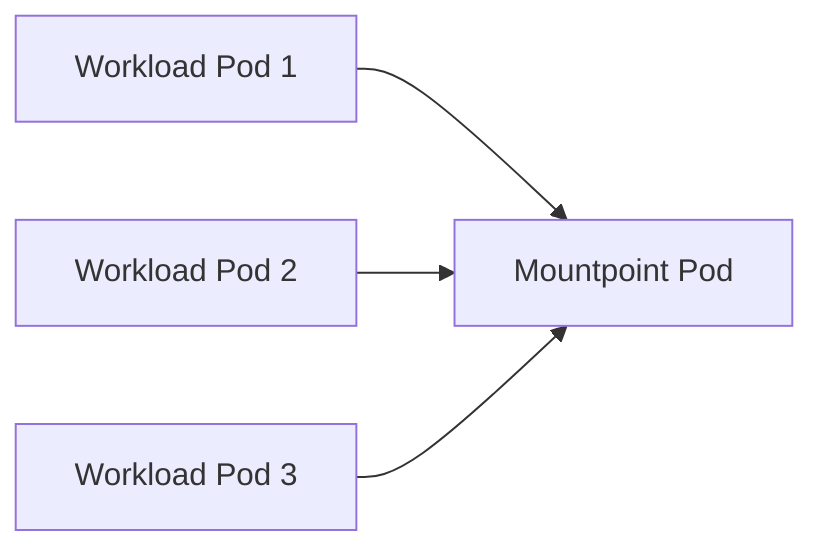

# Features of the Mountpoint for Amazon S3 CSI Driver

This document provides detailed explanations of specific features in the Mountpoint for Amazon S3 CSI Driver.

## Pod Sharing

Pod Sharing improves resource utilization by allowing multiple workloads to share a single Mountpoint instance when appropriate.

### How Pod Sharing Works

With Pod Sharing, the CSI Driver can reuse existing Mountpoint instances between multiple workloads instead of creating one instance per workload. This reduces the overall number of Mountpoint instances in your cluster, leading to better resource utilization.

The CSI Driver only shares Mountpoint instances between multiple workloads if all of the following conditions are met:

- Workloads are scheduled on the same node
- Workloads use the same volume (same PV name and volume ID)
- Workloads use the same mount options
- Workloads use the same authentication source (`driver` or `pod`)
- Workloads have the same FSGroup (if specified)
- For pod-level identity, workloads must also have:
  - The same namespace
  - The same service account name
  - The same IAM role ARN (from service account annotation)

### How Pod Sharing is Implemented

Pod Sharing is implemented using a Custom Resource Definition (CRD) called `MountpointS3PodAttachment`. This CRD stores the mapping between Mountpoint Pods and Workload Pods and serves as the source-of-truth for which workloads are assigned to which Mountpoint Pods.

The CSI Driver Controller component manages these CRDs based on workload pod events:
- When a new workload pod is scheduled, the controller checks if there's an existing Mountpoint Pod that can be shared
- If a suitable Mountpoint Pod exists, the workload is added to its attachments list
- If no suitable Mountpoint Pod exists, a new one is created
- When a workload pod is terminated, it's removed from the attachments list
- When a Mountpoint Pod has no more attached workloads, it's marked for unmounting and termination

The CSI Driver Node component reads these CRDs to determine the correct Mountpoint Pod to use during mount operations and creates bind mounts from the Mountpoint Pod to each workload pod.