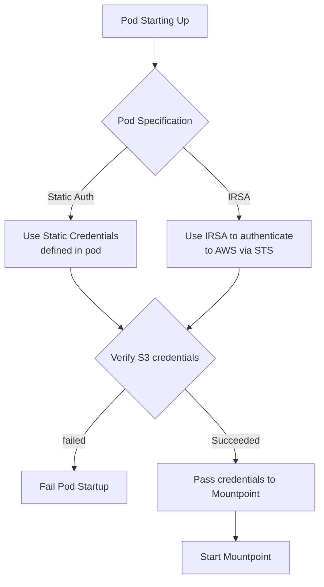

# CSI Driver Credential Provider

This package provides the interface between the CSI Driver and the credential providers that can authenticate to S3.
These credential providers work by implementing the `CredentialProvider` interface.

## Architecture



## Credential Providers

The CSI Driver includes several credential providers:

### `AwsProfile`

Credentials provider that sources credentials by parsing an AWS Profile.

### `EnvCredentials`

Credentials provider that sources credentials from environment variables.

## How it works

The credential provider interface is the method used by the CSI driver to interact with the credential providers:

```go
type CredentialProvider interface {
    Retrieve(ctx context.Context) (*Credentials, error)
}
```

The CSI driver determines which credential provider to use based on the volume configuration and instantiates the
appropriate provider. It then calls `Retrieve()` to get the credentials for that volume.

## Adding new credential providers

To add a new credential provider:

1. The driver calls `credProvider.Retrieve(ctx)` to get credentials  
2. The credential provider returns a `Credentials` struct with the access key, secret key, and optional session token  
3. The CSI driver uses these credentials to mount the S3 bucket  

The credential provider can source these credentials from any location (environment variables, files, external services, etc.)
as long as it implements the `CredentialProvider` interface.
